I am a Final year Computer Science PhD candidate in [ILab](https://ilab.usc.edu/) at the [University of Southern California](https://usc.edu) working with Prof. [Laurent Itti](http://ilab.usc.edu/itti/). You can find my [Resume](files/kiran_cv.pdf), [CV](files/kiran_cv.pdf), [Research](https://klekkala.github.io/research/) and [Bio](https://klekkala.github.io/bio/).

My PhD thesis is on Transferrable Pretrained models for Visual Navigation that can be deployed on Mobile Robots. Along with this I'm also interested in 3D Generative models that allow us to build effective Simulators from Real-world data.

Along with the above research areas, I'm also interested in engineering pipelines for efficient training and inference for ML models. I'm also a full-stack roboticist and worked on building and deploying models onto hardware platforms. We recently built a large-scale mobile-robot for our experiments. Please visit the [Beobotv3](https://klekkala.github.io/hardware/) project for more details.

During my undergraduate studies, I worked on Autonomous Visual Navigation for Quadcopter as part of my Hons. Project. I implemented state-estimation modules, primarily using sensor fusion for visual-inertial SLAM methods.

## Research

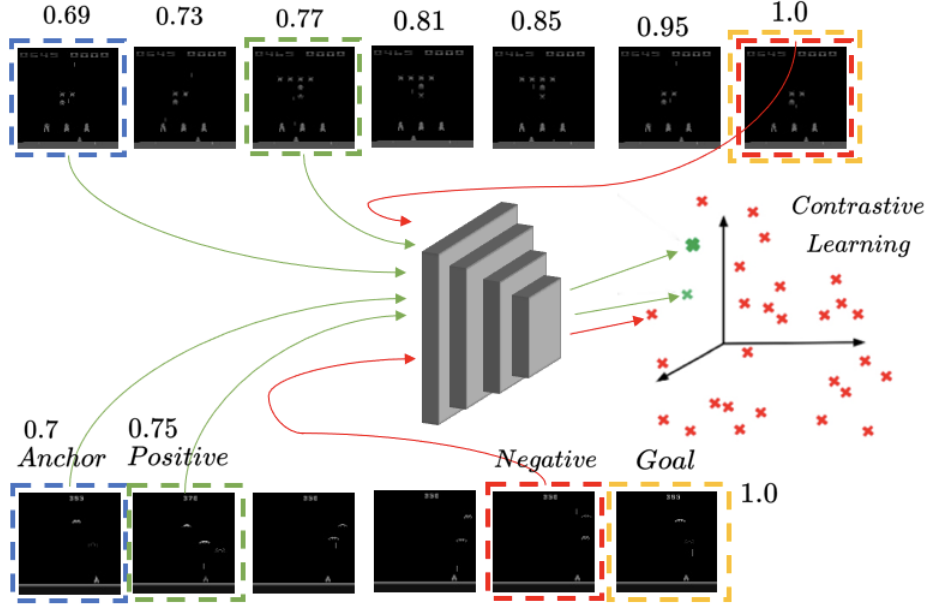
<td>
  
 <a href="https://arxiv.org/abs/2312.12339" style="text-decoration:none"> Value Explicit Pretraining for Goal-Based Transfer Learning  </a>
  <strong>Kiran Lekkala</strong>, Henghui Bao, Sumedh Sontakke, Laurent Itti   <em>Spotlight presentation at CoRL 2023 Pretraining for Robot Learning; Submitted to International Conference on Machine Learning (ICML) 2024. </em>   A novel method that allows for learning Task-agnostic representations based on a Contrastive loss that uses value function estimates obtained using a sequence of observations.

</td>

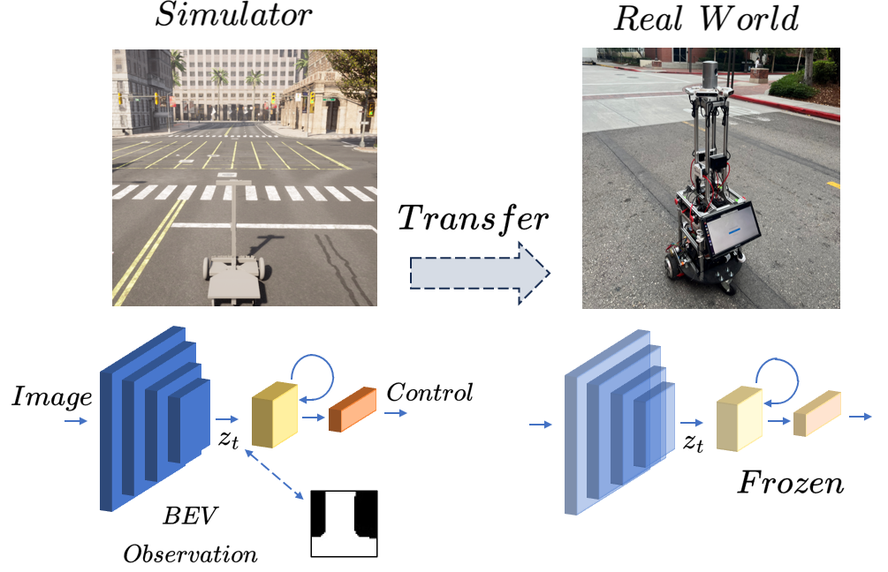
<td>
  
 <a href="https://sites.google.com/usc.edu/world-model-sim2real" style="text-decoration:none"> World model-based Sim2Real Transfer for Robot Visual Navigation   </a> 
  Chen Liu*, <strong>Kiran Lekkala*</strong>, Laurent Itti   <em>Accepted to NeurIPS 2023 Robot Learning Workshop; Under Review at International Conference on Robotics and Automation (ICRA) 2024. </em>   We propose a robust system that integrates a control policy, trained within a simulator, with an internal LSTM-based robustness-enhanced world model and an external visual perception model, facilitating seamless application of the policy in real-world scenarios.

</td>

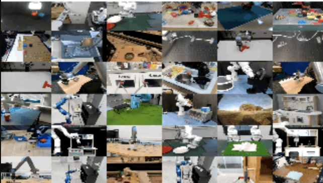
<td>
  
 <a href="https://robotics-transformer-x.github.io/" style="text-decoration:none"> Open X-Embodiment: Robotic Learning Datasets and RT-X Models   </a> 
  Open X-Embodiment Collaboration   <em>Accepted at International Conference on Robotics and Automation (ICRA) 2024. </em>   We introduce the Open X-Embodiment Dataset, the largest robot learning dataset to date with 1M+ real robot trajectories, spanning 22 robot embodiments. We train large, transformer-based policies on the dataset (RT-1-X, RT-2-X) and show that co-training with our diverse dataset substantially improves performance.

</td>

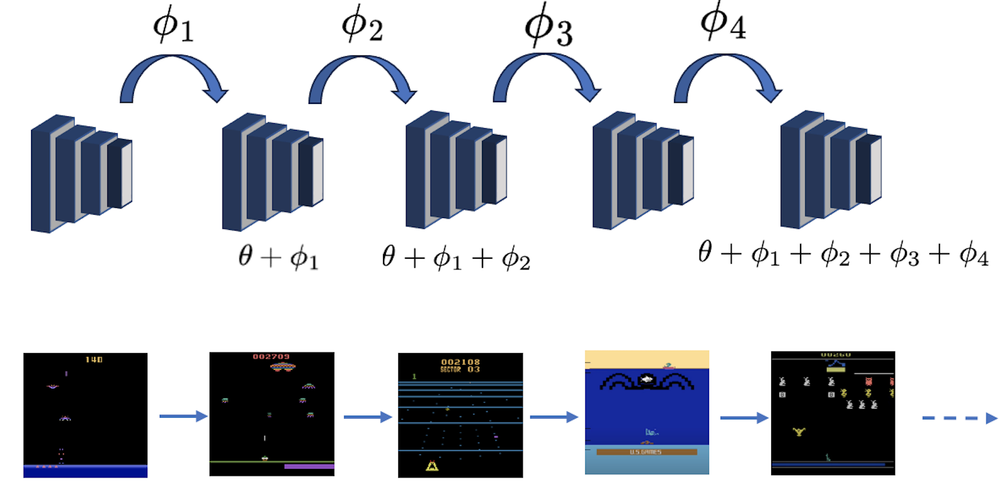
<td>
  
 <a href="https://openaccess.thecvf.com/content/WACV2024W/Pretrain/papers/Lekkala_Evaluating_Pretrained_Models_for_Deployable_Lifelong_Learning_WACVW_2024_paper.pdf" style="text-decoration:none"> Evaluating Pretrained models for Deployable Lifelong Learning   </a> 
  <strong>Kiran Lekkala*</strong>, Eshan Bhargava*, Laurent Itti   <em>In Submission to Conference on Lifelong Learning Agents (CoLLA) 2024; Also published at WACV 2024 Workshop on Pretraining. </em>   We implement our novel Scalable Lifelong Learning system that is capable of retaining knowledge from the previously learnt RL tasks. We also create a novel benchmark for evaluating a Deployable Lifelong Learning system for Visual Reinforcement Learning (RL) that is pretrained on our curated dataset. 

</td>

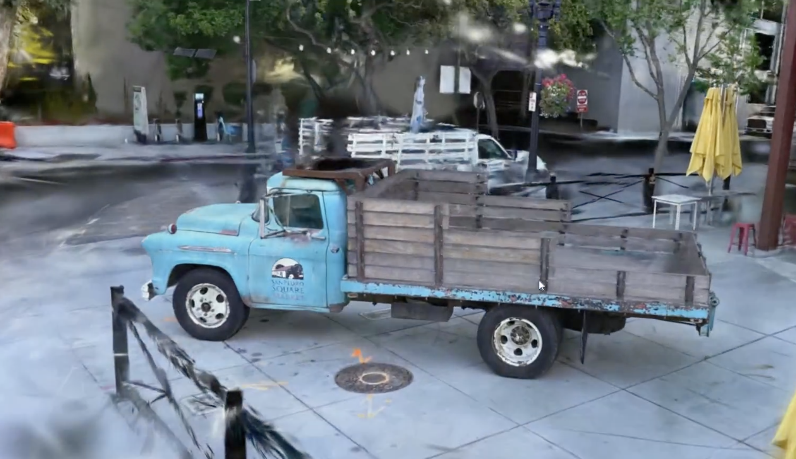
<td>
  
 <a href="https://sites.google.com/usc.edu/gsnav" style="text-decoration:none"> Real-world Visual Navigation in a Simulator using Scene Generation   </a> <strong>Kiran Lekkala</strong>, Henghui Bao, Laurent Itti   <em>Presented at Annenberg Symposium 2023. Awarded cash prize. In Submission to NeurIPS 2024 Dataset and Benchmarks Track. </em>   We design a data-driven simulator for outdoor navigation that employs Gaussian Splatting for rendering, and uses a graph based engine to query appropriate splat file during simulation. 

</td>

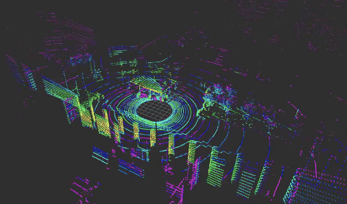
<td>
  
 <a href="https://sites.google.com/usc.edu/uscilab3d" style="text-decoration:none"> USCILab3D Dataset: A Large-scale, Long-term, Semantic, Outdoor 3D Dataset   </a> <strong>Kiran Lekkala</strong>, Henghui Bao, Laurent Itti   <em>In Submission to NeurIPS 2024 Dataset and Benchmarks Track. </em>   We release a 3D dataset, consisting of images and pointclouds, that is collected over the span of an year on a large campus-scale environment. We also propose a novel 3D point. 

</td>

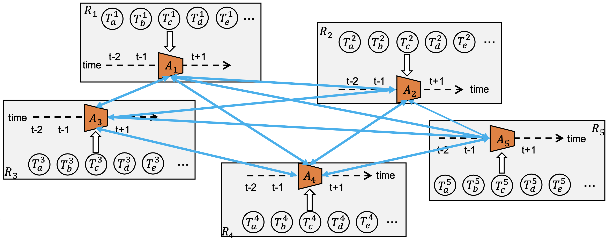
<td>
  
 <a href="https://arxiv.org/abs/2305.15591" style="text-decoration:none"> Lightweight Learner for Shared Knowledge Lifelong Learning   </a> Yunhao Ge, Yuecheng Li, Di Wu, Ao Xu, Adam M. Jones, Amanda Sofie Rios, Iordanis Fostiropoulos, Shixian Wen, Po-Hsuan Huang, Zachary William Murdock, Gozde Sahin, Shuo Ni, <strong>Kiran Lekkala</strong>, Sumedh Anand Sontakke, Laurent Itti   <em>Published in Transactions on Machine Learning Research; Also Presented at ICML LLW 2023. </em>   We propose a robust system that integrates a control policy, trained within a simulator, with an internal LSTM-based robustness-enhanced world model and an external visual perception model, facilitating seamless application of the policy in real-world scenarios. 

</td>

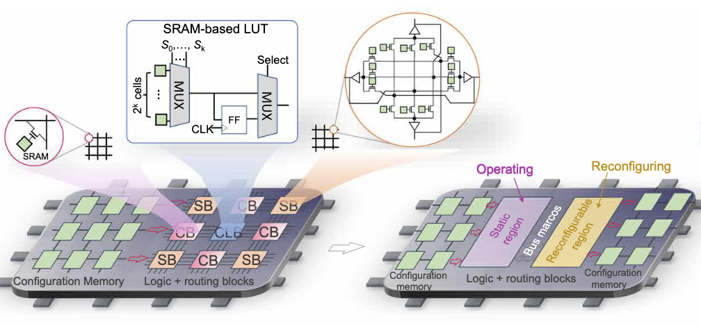
<td>
  
 <a href="https://www.science.org/doi/full/10.1126/sciadv.adk1525" style="text-decoration:none"> Ferroelectric FET based Context-Switching FPGA Enabling Dynamic Reconfiguration for Adaptive Deep Learning Machines.   </a>
    Yixin Xu, Zijian Zhao, Yi Xiao, Tongguang Yu, Halid Mulaosmanovic, Dominik Kleimaier, Stefan Duenkel, Sven Beyer, Xiao Gong, Rajiv Joshi, X Sharon Hu, Shixian Wen, Amanda Sofie Rios, <strong>Kiran Lekkala</strong>, Laurent Itti, Eric Homan, Sumitha George, Vijaykrishnan Narayanan, Kai Ni   <em>Published in Science Advances. </em>   We propose a robust system that integrates a control policy, trained within a simulator, with an internal LSTM-based robustness-enhanced world model and an external visual perception model, facilitating seamless application of the policy in real-world scenarios. 

</td>

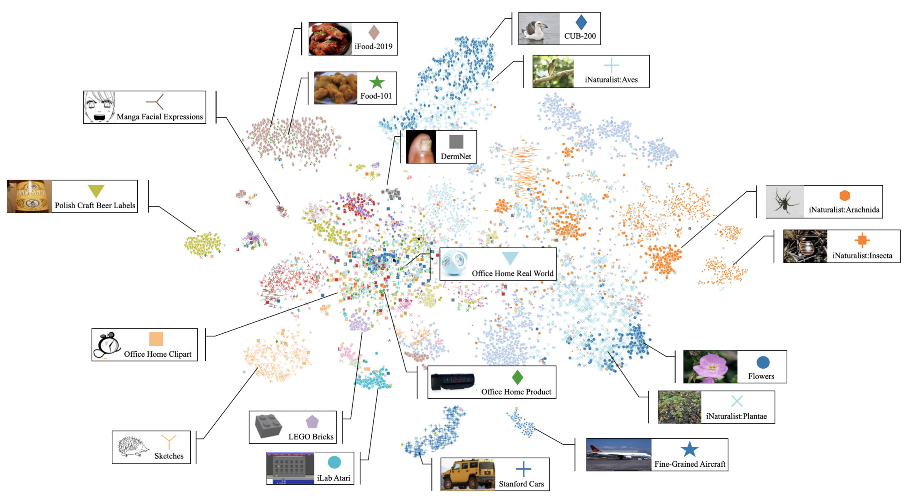
<td>
  
 <a href="https://www.mdpi.com/2306-5729/8/10/153" style="text-decoration:none"> USC-DCT: A Collection of Diverse Classification Tasks   </a>
    Adam M Jones, Gozde Sahin, Zachary W Murdock, Yunhao Ge, Ao Xu, Yuecheng Li, Di Wu, Shuo Ni, Po-Hsuan Huang, <strong>Kiran Lekkala</strong>, Laurent Itti   <em> Published in MDPI </em>   This paper provides a methodology for processing and cleaning datasets that can be applied to existing or new classification tasks as well as implements these practices in a collection of diverse classification tasks called USC-DCT. Constructed using 107 classification tasks collected from the internet, this collection provides a transparent and standardized pipeline that can be useful for many different applications and frameworks. 

</td>

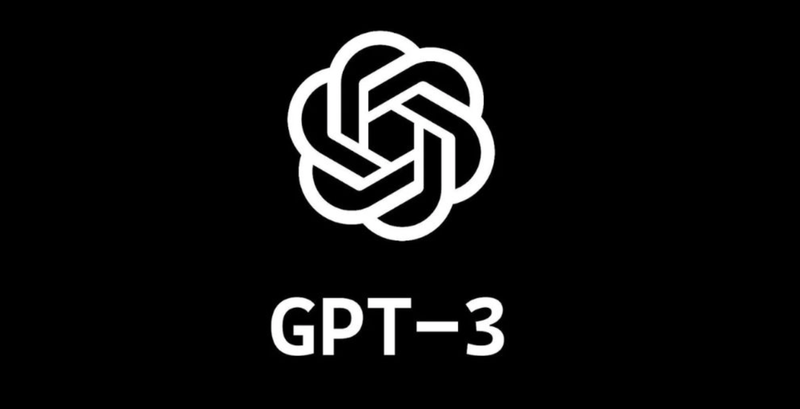
<td>
  
 <a style="text-decoration:none"> Paragraph Segmentation from Audio Transcripts using LLM based Semantic Grounding   </a>
    <strong>Kiran Lekkala</strong>    We develop a method that allows for segmenting semantically conistant paragraphs from diaterization tool like whisper 

</td>

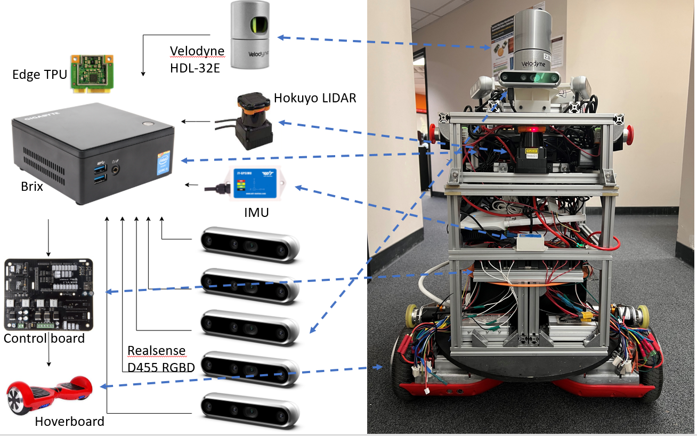
<td>
  
 <a style="text-decoration:none"> Low Cost Autonomous Mapping system for 3D-LLM based Scene Understanding   </a>
    <strong>Kiran Lekkala</strong>, Laurent Itti     We propose a robust system that integrates a control policy, trained within a simulator, with an internal LSTM-based robustness-enhanced world model and an external visual perception model, facilitating seamless application of the policy in real-world scenarios.

</td>

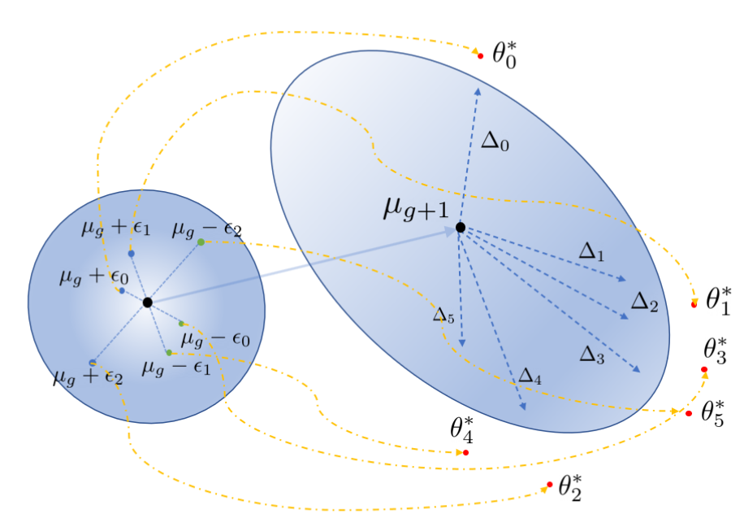
<td>
  
 <a href="https://ieeexplore.ieee.org/abstract/document/9561607" style="text-decoration:none"> Shaped Policy search for Evolutionary strategies using waypoints   </a> 
  <strong>Kiran Lekkala</strong>, Laurent Itti   <em>Published at International Conference on Robotics and Automation (ICRA) 2021 </em>     We propose a robust system that integrates a control policy, trained within a simulator, with an internal LSTM-based robustness-enhanced world model and an external visual perception model, facilitating seamless application of the policy in real-world scenarios.

</td>

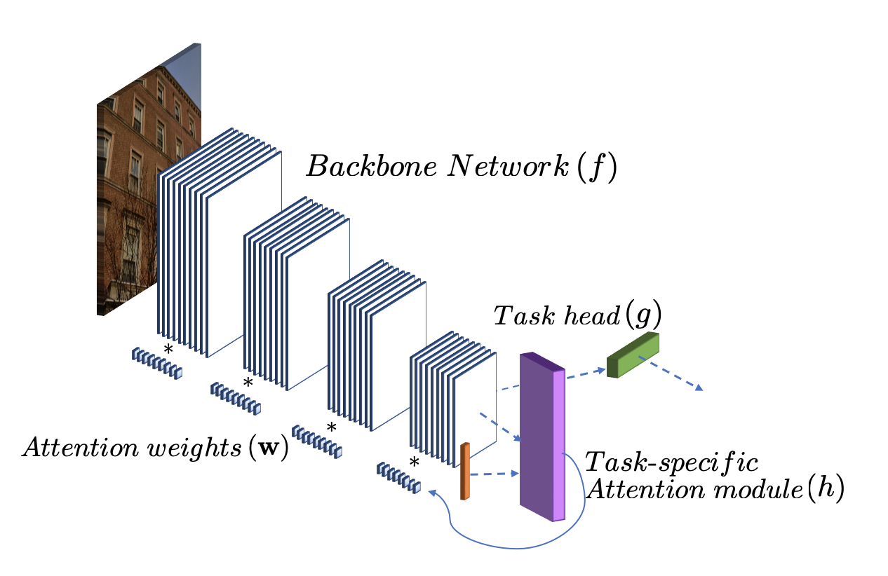
<td>
  
 <a href="https://arxiv.org/abs/2006.07438" style="text-decoration:none"> Attentive Feature Reuse for Multi Task Meta learning   </a> 
  <strong>Kiran Lekkala</strong>, Laurent Itti   <em>Presented at ICLR 2021 Embodied Multimodal Learning workshop; </em>     We propose a robust system that integrates a control policy, trained within a simulator, with an internal LSTM-based robustness-enhanced world model and an external visual perception model, facilitating seamless application of the policy in real-world scenarios.

</td>

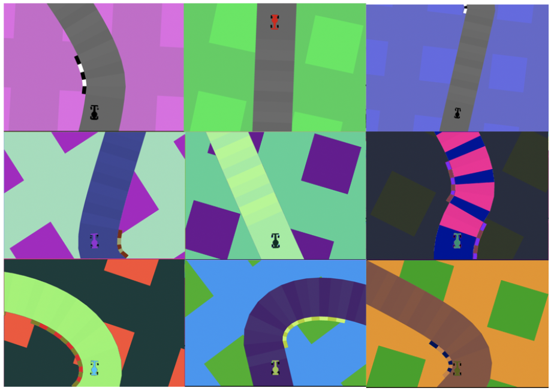
<td>
  
 <a href="https://arxiv.org/abs/1911.10322" style="text-decoration:none"> Meta adaptation using Importance weighted Demonstrations   </a>
    <strong>Kiran Lekkala</strong>, Laurent Itti    We propose a robust system that integrates a control policy, trained within a simulator, with an internal LSTM-based robustness-enhanced world model and an external visual perception model, facilitating seamless application of the policy in real-world scenarios.

</td>

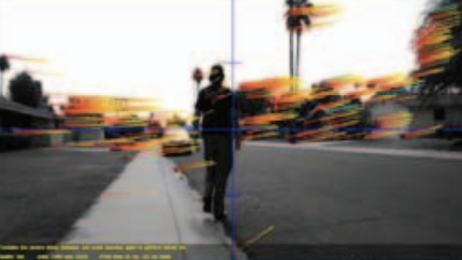
<td>
  
 <a href="https://ieeexplore.ieee.org/abstract/document/7848025" style="text-decoration:none"> Simultaneous Aerial Vehicle Localization and Human Tracking   </a>
    <strong>Kiran Lekkala</strong>, VK Mittal   <em>Published at TENCON 2015 </em>   We propose a robust system that integrates a control policy, trained within a simulator, with an internal LSTM-based robustness-enhanced world model and an external visual perception model, facilitating seamless application of the policy in real-world scenarios.

</td>

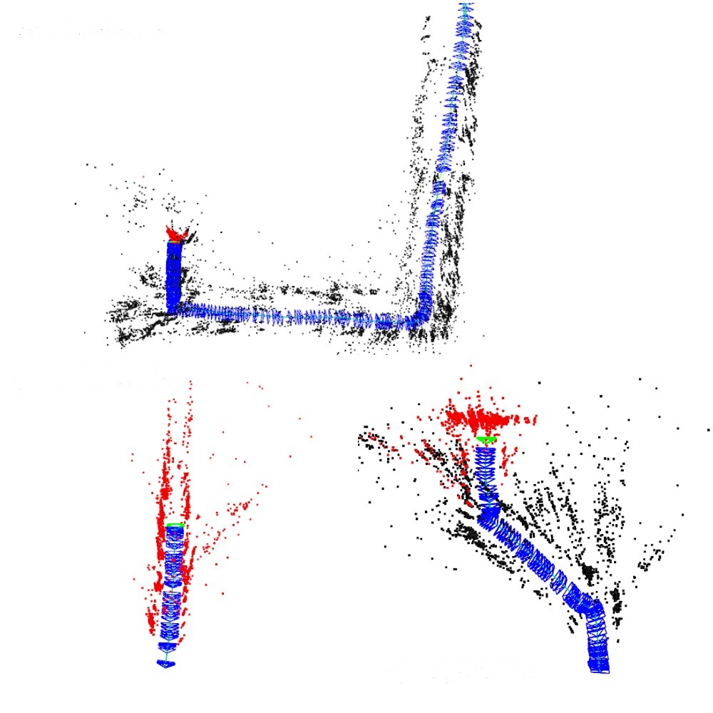
<td>
  
 <a href="https://ieeexplore.ieee.org/abstract/document/7838890/" style="text-decoration:none"> Accurate and Augmented Navigation for Quadrocopter based on Multi-Sensor Fusion   </a>
    <strong>Kiran Lekkala</strong>, VK Mittal  <em>Published at INDICON 2016. </em>   We propose a robust system that integrates a control policy, trained within a simulator, with an internal LSTM-based robustness-enhanced world model and an external visual perception model, facilitating seamless application of the policy in real-world scenarios.

</td>

## Teaching
 

<td>
  

    <u>CSCI 561: Foundations of Artificial Intelligence </u>
       

</td>

<td>
  

    <u>CSCI 570: Analysis of Algorithms </u>
       

</td>

I borrowed this website from this amazing [repository](https://github.com/academicpages/academicpages.github.io).
